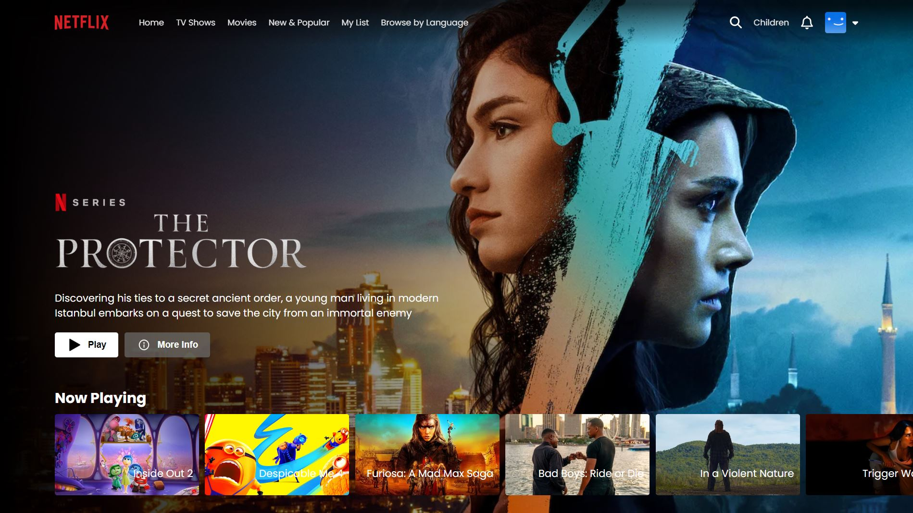
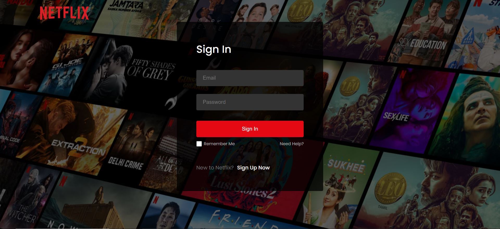
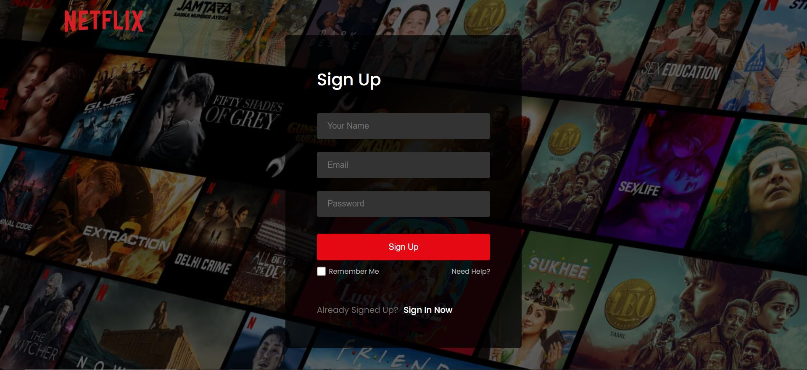
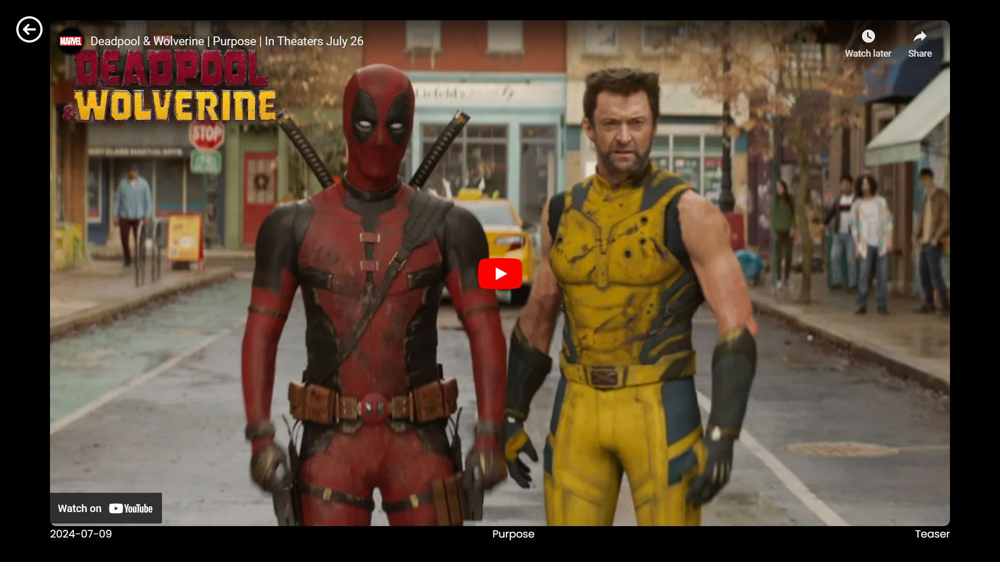

# Netflix Clone

A Netflix clone built using Vite, React, and Firebase for authentication. The project aims to replicate the front-end design and some core functionalities of Netflix.
For the Working Demo, visit this site - https://streaming-platform-clone-zeta.vercel.app/login

## Table of Contents

- [Features](#features)
- [Screenshots](#screenshots)
- [Installation](#installation)
- [Deployment](#deployment)


## Features

- User Authentication (Sign In/Sign Up)
- Responsive Design
- Video Playback
- Dynamic Routing

## Screenshots

### Home Page


### Sign In Page


### Sign Up Page


### Video Player



## Installation

To get a local copy up and running, follow these simple steps.

### Prerequisites

- Node.js and npm installed
- Firebase account for authentication

### Clone the Repository

```bash
git clone https://github.com/BhargavA29/Netflix-clone.git
cd netflix-clone
npm install
npm run dev
